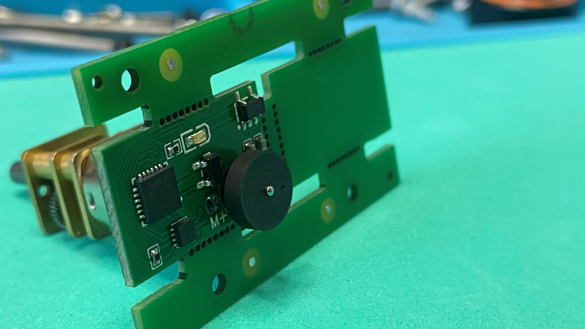

# XMoto
very small I2C brushed motor controller

Transcribed text from my german(!) video:https://youtu.be/MuoPkisycU4

---

It is so far, last time I designed a board that should run a motor via I2C. Two days ago the board finally arrived and I have to say I am thrilled about the result, but see even here is a small UNPack video that should show you how the boards arrived and in what condition I saw them the first time.

Unpacking

 the circuit boards themselves were packed in a plastic bag, and I also got an extra roll of insulating tape. The boards were glued together on the backside with a normal tape and the first impression of the boards was already overwhelming, because the result looked very clean. 

But of course the devil is always in the details and it would not be the first board that would not work for me immediately. You always have to expect mistakes, and that can drive you crazy sometimes, because you put so much time into the design and probably forgot something.

I also took a motor and checked if the mechanics fit, I have to say the motor just went into the existing hole, but that doesn't matter. The soldering lugs fit exactly into the holes, as you can see on the photo here and the whole thing holds by itself. But I save that for now, because I plan to do some tests with this board.
Price
Now let's get to the most important thing, the price! I paid for the order around 58 Euro (-$7 discount), in there was the delivery, the production and so on, in addition you also have to take into account the customs clearance from DHL, which amounts to this: 
the import sales tax was 9,91 €
the commission for the provision of capital costs 12.50 €, 
and 
the value added tax on the capital provision commission was € 2.38 
So I paid 24.79 at the front door, so let's say 25 €. 
If we add it all up, we come to a price of about 77 euros.

Since these were 10 boards, which are completely assembled, one board costs me 7.70 €. This is actually still possible, I imagined it to be more expensive. 

But you can still influence the price very much by providing more PCBs on a panel and thus get more for our money. Maybe I'll make a video about this, you can watch the workaround I published last week in my video channel. Here a panel will be produced that can be used in the SMD assembly, because easyeda still has a bug there. 
This way we can order panels with a maximum size of 400 x 400 mm, and a lot of XMotos fit on it :). Then the total price per board will also be lower.
Testing

 So what do we test first, if you have such a finished board in front of you, you should test if there is a short circuit between ground and positive, if you have done that, the next step would be to apply a normal voltage of say 7 volts to test if the voltage regulator works, there should be 5 volts at the output and on the oscilloscope it should look relatively straight.

UDPI
 First I try to load a blink sketch on the ATtiny 16/17 with the new UDPI or "Unified Program and Debug Interface". You only need one line to program the MPU, this is done quickly by loading the sketch on an Arduino nano and then connecting pin D6 with the reset line of the atiny via a resistor. I linked the manual in english in the video description, you can read all about it and now we try it by ourselves. 

https://www.elektormagazine.de/news/review-attiny817-xplained-mini/14732
https://www.electronics-lab.com/project/getting-started-with-the-new-attiny-chips-programming-the-microchips-0-series-and-1-series-attiny-with-the-arduino-ide/

Prepare

For this we need three cables first of course we have to connect to ground, the second is connected to 5 Volt plus from the Arduino nano and the third is the UDPI cable which is connected directly to the reset port of the Attiny's on the back of the board.

So we take out the soldering iron and off we go we need a 4 pin connection on the back of the board plus a connection to the UDPI port point, that's it and we can install the software on our computer according to the instructions. And what can I tell you, it worked right away. It was a nice feeling to see the LED lights and to know that the board works in its basic features. I was very relieved because to repair something on this board is a little bit more difficult, because the components are so small that with my 53 years there I have a pro

